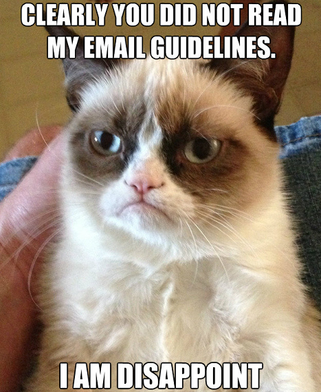

Email Policy
============

At some point in the past, I spent probably about 25 hours responding to student
email. It is _fantastic_ that you are willing to ask questions. Keep doing that!
_But_, many of the emails indicated that people weren't thinking critically, or
asking around among their peers. This has led to the following policy for
sending me email on course topics. 

The policy does two things. First, it means you have to start learning how to
troubleshoot problems on your own (which is a primary skill for anybody
developing software), and it means that when I do get email from a student it is
likely something really weird, and I enjoy troubleshooting weird things.

The policy is:

1. Before emailing, try to __characterize the problem__. Do not email
anybody saying "it doesn't work". This is vague to the point of
pointlessness. When you do email, summarize the problem.

2. Before emailing, try to __debug the problem and find where__ the problem
arises. You can do this with a debugger if you know how to do that, or (as I
prefer) you can use print statements in your code. When you do email, summarize
what you've already done to troubleshoot.

3. Email your __LA before emailing Gabe__ on issues that you think the LA can
handle. They are paid for this. 

4. When emailing about code, be sure I can access your code easily. You could
__make a GitHub Gist__ and send the link, or if you're using something like
__the p5.js web editor__, share a link from there. This way we can refer to
symbols by line number, and can converse using GitHub. You can create a private
or public Gist, it doesn't matter to us.

5. When emailing us on any topic, __use correct (or approximately correct)
English__. If we can't understand what you're even asking we may just delete the
email without responding. Communicating clearly is another primary skill of...
well, anybody with a college degree. _If English is not your main language,
don't worry. Just make an effort._

