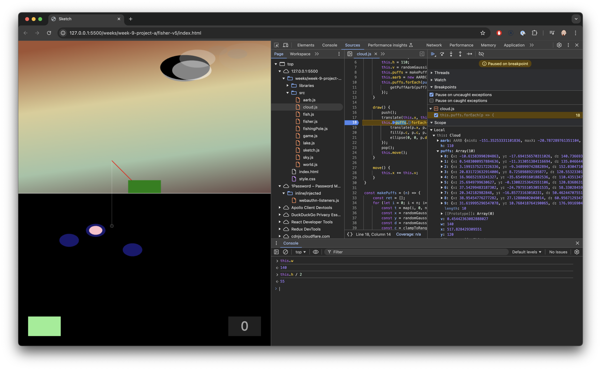

# Debugging and Good Coding Practices

    Gabe Johnson
    October 2024

---

I have to admit that it felt a little bit self-absorbed when I just wrote that
header: "Good Coding Practices". I've been coding for over 30 years and I am
still discovering what that means for me, so it is a _little_ obnoxious to think
that I can just summarize a complete definitive list. Consider this a "here's
how I see it at the moment" sort of thing. Still: 30 years is a long time to do
practice any art, and I want to share that experience so you can learn from it.

This essay is about both _debugging_ and the other side of its coin, _good coding
practices_. Debugging is the art of finding and fixing problems with your code,
and good practices is the art of avoiding those problems in the first place.

## Debugging vs Bugging

If you're not debugging, you're bugging. If you want to build software, you'll
have to face the inevitable fact that the code that you write will have bugs in
it mixed in with all those wonderful features. The trick is to know how to find
and (maybe) fix those problems.

## You Don't Know What You're Building (And That's OK)

Here's a tale of three programmers who all have the same problem but very
different ways of seeing it:

First, find me an average programmer and ask them what they're building. They'll
probably have an assertive response about who it is for, how they'll use it,
what exactly it will do, what the system architecture is, and so on.

Now find me a good programmer. They'll tell you all of that, but they'll also
dwell on the problems: the system was never built for this use case, they don't
have clear enough requirements, several important things haven't been
considered, there's not enough time, and *sigh* they have to work with Gabe.

Last, an excellent programmer will address both the "what it should do" and the
"what are the likely hurdles" stuff, and also have a well-balanced view of it
all. They'll be aware of the challenges and have an intuition of which are the
ones that can be ignored, or dealt with incidentally, and what are the things
that will really take some good whiteboarding. They know that given finite time
and resources, perfection isn't possible, and they're OK with this.

All three programmers in this concocted tale are working on the same thing. The
average programmer is fixated on what they think it _is_. The good programmer is
mostly thinking about _what could go wrong_. The excellent programmer is focused
on rolling with uncertainty and _getting the thing built_.

This is because regardless of how skilled or experienced you are, _you will
never fully know what you're building_. So you might as well get on with
building it so you can more easily spot the things you don't know. The
difference is a matter of earned attitude - and this comes with experience. 

### Thinking vs Doing

My goal here is to ask you to get on with things anyway without perfect
information. But what do I mean by "get on with things"? Some people have a bias
towards action; some are biased towards thinking. In practice, you'll need to
develop an intuition for which mode to proceed. 

Many challenges are best uncovered by action! Some non-programming examples:

* Don't know what to draw? Draw toilets! You'll get sick of this really fast.
  Just get that pencil moving.
* Lunch crew indecisive about where to go? Suggest McDonalds! Everybody will
  instantly come up with a better idea.
* Can't find anything in your garage? Start cleaning and re-organizing.
  Eventually it will be good enough and you can abdicate.

Other problems lend themselves to "thinking". The scare quotes are there because
this is almost never "stare at the wall and think deep thoughts". What I mean by
"thinking" is actually to _do something_ that helps you understand the problem
and possible solutions more clearly. Talk it out with a colleague. Make diagrams
on on paper, a whiteboard, or a design tool. Make a software prototype that is
completely separate from the main codebase.

So "thinking" is really just a form of "action" that helps clarify the
situation. 

An important aside here is that in industry, the bias to action reigns so
supreme, that if anybody believes you're _thinking_, they'll tell you to stop
wasting your time and get on with building. Very Serious People™ say this sort
of thing. And what they mean (at least, what I hope they mean) is that
"thinking" with scare quotes can look an awful lot like spinning your wheels and
making no progress at all, while others are getting things done. They might be
right! If your "thinking" is not contributing to progress, consider a more
active mode of building.

### Problem Finding, Problem Solving

Choose between these:

* Option A: a perfectly built, highly optimized system that solves a non-problem
* Option B: mostly functional, mostly usable system that solves a problem that
  causes you great pain

Engineers love to build and optimize. I love it. But as Peter Drucker once
wrote, "there is nothing so useless as doing efficiently that which should not
be done at all". If you're going to apply your time and talent to writing code,
shouldn't you work on the right problem?

Engineers don't generally love defining the problem: who has it, what we might
do about it, what's feasible, how long it will take (because money), and so on.
But if you want to build the right thing for the right people in the right way,
you really need to address the "why" before the "how" is even relevant.

## Three Virtues

According to Larry Wall, the original author of the Perl programming language,
there are three great virtues of a programmer; Laziness, Impatience and Hubris.

**Laziness**: The quality that makes you go to great effort to reduce overall
energy expenditure. It makes you write labor-saving programs that other people
will find useful and document what you wrote so you don't have to answer so many
questions about it.

**Impatience**: The anger you feel when the computer is being lazy. This makes
you write programs that don't just react to your needs, but actually anticipate
them. Or at least pretend to.

**Hubris**: The quality that makes you write (and maintain) programs that other
people won't want to say bad things about.

I'm mentioning these mostly because it is funny, but inside that there's a lot
of truth to it. You'll grow into these virtues, maybe. This isn't permission to
be a lazy impatient jerk.

## Debugging

Death, taxes, and software bugs.

So if writing code is the way to solve some problem, and you don't know what
you're building, and you're imperfect and make mistakes, wrong assumptions, or
miscommunicate with the other humans involved, you will find yourself with bugs.
I guarantee this, 100%. 

### Characterize Bugs

There are a few common types of bugs, and I'm going to talk about many of them
in a minute. But first, there's the idea that you can classify software defects
just like you'd classify the insect variety of bugs. Sort of.

### Error Messages

As you code, you'll get error messages. They could be runtime errors that happen
while your program is running, or they could be build-time errors as you write
the code in the first place. Error messages are often hard to understand, and
might actually send you down the wrong path.

For example, if you're missing a semicolon or a comma, or some other subtle but
important piece of syntax, the error message might be completely unrelated to
semicolons or commas. Sorry. In those cases, if you look at the related code and
take the error message at its word, you'll be met with frustration. For example:


The message is `SyntaxError: Unexpected identifier 'i'`.

The actual problem is that there's a missing semicolon separating the for-loop's
variable declaration and the boolean expression that checks if the loop should
continue. The message says that `i` was _unexpected_. It was _expecting_
something else - but the `i` didn't fit the grammar, and that's the specific
problem that the Javascript interpreter can report back to you.

Once you take the literal message with a grain of sand and look at the line, you
might spot the issue. _Or_ the problem might be nearby, usually on the previous
line.

If the message really baffles you, copy/paste it into a search engine. You might
have to edit the message a bit if it includes file names and the like that are
specific to you. But somebody else has likely asked about this error on Stack
Overflow, or blogged about it somewhere.  

### Cocker Spaniel AKA Rubber Duckie

The computer is only doing what you told it to do. So if it is misbehaving,
that's your fault 😜

The mismatch is between what you _think_ you're telling it to do, and what
you're _actually_ telling it to do. Sometimes it is useful to _slow wayyyyy
down_ and look at each individual line, or even individual expressions within a
line. Ask yourself: what do I _want_ it to do, and what is it _actually_ doing?

A great way to do this is to find a friend, colleague, pet, or rubber duck, and
litterally talk it out. Say the words out loud. That forces you to articulate
things in words slowly enough that you are forced to actually understand it.

### Print Statements

In Javascript, you can write things like `console.log("value is:", val);` and it
will write something like `value is: null` to a console somewhere. In browsers
this is usually in the developer console. Every language that I'm aware of has
some form of print statement like this.

In this case, if it says the value is `null`, I'll guess that's a problem
because `null` is like a little unexploded bomb waiting to ruin your day.

Often, crusty people will tell you that you should never use print statements
and should always prefer using a proper debugger. They're wrong about the
'never' part, but they're right to suggest using a proper debugger. Print
statements are extremely convenient, though, and if you spend more than a few
minutes debugging something that way, you're probably doing it wrong.

Just remember to remove the print statements once they've served their purpose.
Nobody likes noisy console chatter. 

### Logs

If you really need to have a record of what your code does, consider using a
logging package. If you're just starting to learn to code, this is probably
overkill. But if you're writing code that runs on a backend server, or a
physical computing device like an Arduino, then writing logs can be a great way
to conduct forensics after something has gone wrong.

### A Proper Debugger

Our crusty friend that I mentioned earlier wants us to use a proper debugger.
These tools generally work like this: the program runs in a debugging mode. You
can pause it and inspect the state of the program, and even step through it one
expression or line at a time. You can set a 'break point' so it will run until
it gets to that break point and then pause. For example:



Here I have a local web app that is using raw HTML and Javascript files. I've
set a breakpoint on `clouds.js` at line 18 because I want to take a detailed
look at what it is doing in the `draw` function. You can type into the
interactive console at the bottom to have it run arbitrary code (like typing
`this.h / 2` to see what half the width is). Use the symbol inspector on the
right to see what all the values are, what scope they're in, and so on. 

You can set breakpoints by opening the source file and clicking the line number
(left and middle panes).

I'll draw attention to the controls to inch your way through the code:


The play/pause button at the left will let you resume normal program execution,
at least until it gets to another breakpoint.

The next button is 'step over', meaning it will execute the next statement/line
without diving into any function calls.

After that are the 'step into' and 'step out of' buttons, which will let you
dive into (and out of) a function call, in case you want to go deeper or escape
from where you are.

The last one is simply 'step' and will step forward the by the smallest possible
amount, either a statement, line, or function call.

### Islands of Certainty

If you can isolate the code that you believe to work, then whatever remains is
likely where the problem is. For example, if you are seeing a bug where `val` is
`null`, see if you can figure out if it was _ever_ a good value. You'd be
surprised at how quickly you can isolate where the problem is. Where are all the
locations where `val` can change? Drop a breakpoint or print statement in at
those locations.

### Off-By-One Errors

Whenever you have `n` items and you're stepping through them, it is possible
that you're missing the first one, the last one, or something like that. The
culprit in these cases is often an inequality or an integer:

```
for (int i=0; i <= myList.length; i++>) {
  doSomething(myList[i]); // this will explode when i == length!
}
```

We could fix that by having `i` range from `0` to `myList.length - 1`, or by
using the `<` operator instead of `<=`.

It is said that there are two hard problems in programming: Naming things, cache
invalidation, and off-by-one errors.

These are also sometimes called the 'fencepost' problem. If imagine there's a
fence made by putting boards between posts, there will always be one more
fencepost than boards.

### "Forever Problems" Are Rare In Software

"Measure twice, cut once" is an old carpentry saying that obviously applies to
more than just woodworking. If you're sculpting from marble or something, you
can really wreck your work with an errant swing of the hammer. So there are some
craft activities where mistakes are more or less permanent.

But with software, such problems are actually pretty rare. While a carpenter or
sculpter should have some level of caution before proceeding, a coder can
operate with less fear of making unrecoverable mistakes. From moment to moment,
you can recover from mistakes with the cunning use of Undo. If you're using
source control tools like Git, you can also recover from mistakes by restoring a
past version, or preventing mistakes from coming into the main source code
branch by just not merging in the offending code.

It is true you can have "forever problems" in software, but these are usually
concerning user data or overall system architecture. And even those problems are
fixable, but it might hurt. If you're deploying code to the field - maybe a
non-networked device, or something like a communication satellite that has to be
solid from the beginning, then yes, mistakes are more costly. But such
situations are rare, and besides, there are loads of engineering methods to help
serve as guard rails.

My point here is that you can be a bit cavalier when writing code: you can hack
to explore ideas, and then come back through and improve it. Don't be afraid to
forge ahead and "think with your hands" as some people say.

## In Sum: That Was Too Long?

If you're just starting to code, most of this probably won't resonate. My advice
is to embrace the uncertainty and try to stay at the edge of your comfort zone.
Develop strategies for knowing when to "think" and when to take action. When
things go wrong: don't panic! And there too, you'll need to develop strategies
to discover what's wrong, how to fix it, and how to characterize the mistakes so
you can pattern match better next time.

It takes a long time to become a really good programmer, but it can be a lot of
fun if you have the right frame of mind as you get there.