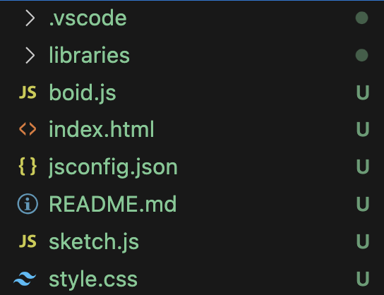

# VS Code Example Project

You can create p5.js sketches on your local computer in a form that makes it much easier to save to git. By using VS Code's "Go Live" feature you can create a little web server locally, and then view your sketch either in a browser like Chrome, or directly in your editor with the Simple Browser.

Here are steps to winning:

## Use P5 Project Creator by Ultamatum

Open VS Code's Extensions and search for "P5 Project Creator" by the user "Ultamatum". Once installed, use the command palette to run the "Create p5.js Project" command. On a mac, the command palette is Command-Shift-P. I'll guess it is Control-Shift-P on windows, let me know if I'm wrong.

This will write some files to disk. Most of these files are created by this extension:



The main files here are `sketch.js`, `sketch.css` and `index.html`. There is a `libraries` directory that holds the `p5.js` bundle.

## Use Live Server

Open the VS Code Extensions once again and install "Live Server" by user "Ritwick Dey".

Now open the `index.html` file. This is the actual entry point to your sketch, and it ties together whatever libraries you're using with your local sketch file(s). We want to serve this particular file on a local web server.

There are a few ways to do this:

- At the bottom of the VS Code editor there are some text doodads. One of them is "Go Live". Click that to serve the file you're on.
- Right click on the HTML file and choose "Open With Live Server"
- You can use the command palette to type "live server" and it will give you an option to open with live server.
- There are keyboard shortcuts as well, you'll need to figure that out if you want to use it.

This starts a server and hopefully also opens your browser to the URL http://127.0.0.1:5500/index.html.

## Show Simple Browser in VS Code

Use the command palette to open a built-in feature called Simple Browser. ("Simple Browser: Show" is the full command.) When you do this it opens a wide browser window inside your editor. Have it load the URL I gave above.

You can flip between tabs inside your editor. If you want to view the code and output at the same time, just drag the Simple Browser tab to the right until it looks like they're side-by-side.

Now you can edit p5.js code on your laptop with your own editor and tools. Fabulous! 

## Extra Credit

Now that you're seeing all the files and have full control over your p5 project, you can start splitting your code into several files. Let's make a simple `Boid` class and refer to it from our main `sketch.js` file.

Create `boid.js` right next to `sketch.js`. Here's code to paste into the new Boid file:

```js
// boid.js
class Boid {
    constructor(x, y) {
        this.x = x;
        this.y = y;
        this.w = 100;
        this.h = 140;
    }

    draw() {
        fill('yellow');
        stroke('black');
        ellipse(this.x, this.y, this.w, this.h);
    }
}
```

This simply defines a class with a single method, `draw`. In order to use it we have to also add it to the `index.html` file:

```html
<!-- part of index.html -->
<body>
  <!-- add a line like the following for every new file you have -->
  <script src="boid.js"></script> 
  <script src="sketch.js"></script>
</body>
```

Then we can use the `Boid` class from the `sketch.js` file. Edit that file to look thusly:

```js
// sketch.js
let tweety;

function setup() {
  createCanvas(400, 400);
  tweety = new Boid(200, 200);
  console.log('Tweety:', tweety);
}

function draw() {
  background(220);
  tweety.draw();
}
```

In the Simple Browser window (or in your actual browser) it should show a yellow ellipse:


